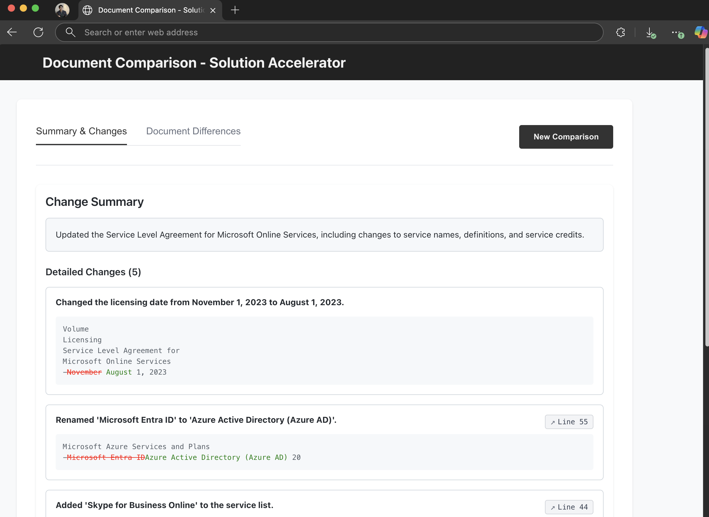

<div align="center">
  <h1>Document Comparison Solution Accelerator</h1>
  <p><strong>A starting point for building change log generation use cases using Azure OpenAI and Document Intelligence</strong></p>
</div>

<div align="center">
  
</div>

<div align="center">
  <p>
    <a href="#features">Features</a> •
    <a href="#prerequisites">Prerequisites</a> •
    <a href="#quick-start">Quick Start</a> •
    <a href="#architecture">Architecture</a>
  </p>
</div>

---

## 🎯 Purpose

This solution accelerator serves as a **reference implementation** and **starting point** for developers looking to build document comparison solutions using Azure services. It demonstrates:

- Integration of Azure OpenAI for intelligent change analysis
- Usage of Azure Document Intelligence for OCR
- Document comparison workflow

> **Note**: This is not a production-ready solution, but rather a foundation to help you get started faster with your own implementation.

## ✨ Features

- 📄 Upload and compare DOCX documents
- 🔍 Interactive diff viewer with line jumping
- 🤖 AI-powered change summarization
- 📊 Similarity scoring and analysis

## 🚀 Prerequisites

- Python 3.8+
- Node.js 16+
- Azure OpenAI service access
- Azure Document Intelligence service access

## ⚡ Quick Start

1. Clone the repository:
```bash
git clone https://github.com/aymenfurter/document-comparison-solution-accelerator.git
cd document-comparison-solution-accelerator
```

2. Set up environment:
```bash
# Copy environment template
cp .env.example .env

# Edit .env with your Azure credentials
nano .env
```

3. Install backend dependencies:
```bash
pip install -r requirements.txt
```

4. Install frontend dependencies:
```bash
cd frontend
npm install
```

5. Start the backend server:
```bash
# From root directory
PYTHONPATH=. uvicorn app.main:app --reload
```

6. Start the frontend development server:
```bash
# From frontend directory
npm start
```

7. Access the application at `http://localhost:3000`

## 🔧 Environment Configuration

Required environment variables in `.env`:

```ini
AZURE_OPENAI_ENDPOINT=https://your-endpoint.openai.azure.com
AZURE_OPENAI_KEY=your-api-key
AZURE_OPENAI_MODEL=gpt-4
AZURE_DOC_INTELLIGENCE_ENDPOINT=https://your-doc-intel.cognitiveservices.azure.com
AZURE_DOC_INTELLIGENCE_KEY=your-doc-intel-key
```

## 🏗️ Architecture

### Backend Components

- 🧠 Azure OpenAI integration for change analysis
- 📝 Azure Document Intelligence for document processing
- 🔄 Diff generation and processing services

### Frontend Components

- ⚛️ React with TypeScript
- 🎨 FluentUI components
- 🔍 Interactive diff viewer
- 📱 Responsive layout

## 🔌 API Endpoints

- `POST /api/v1/upload`: Upload documents for comparison
- `GET /health`: Service health check

## 💻 Development

### Running Tests

```bash
# Run all tests
pytest

# Run integration tests
pytest tests/integration -v -m integration
```

## 🤝 Contributing

Contributions are welcome! Feel free to:

1. Fork the repository
2. Create a feature branch
3. Commit your changes
4. Push to the branch
5. Create a Pull Request

## 📝 License

This project is licensed under the MIT License - see the LICENSE file for details.

## ⚠️ Disclaimer

This solution accelerator is provided as-is and is meant to serve as a reference implementation. You should review and adapt the code to meet your specific requirements and security needs before using it in a production environment.